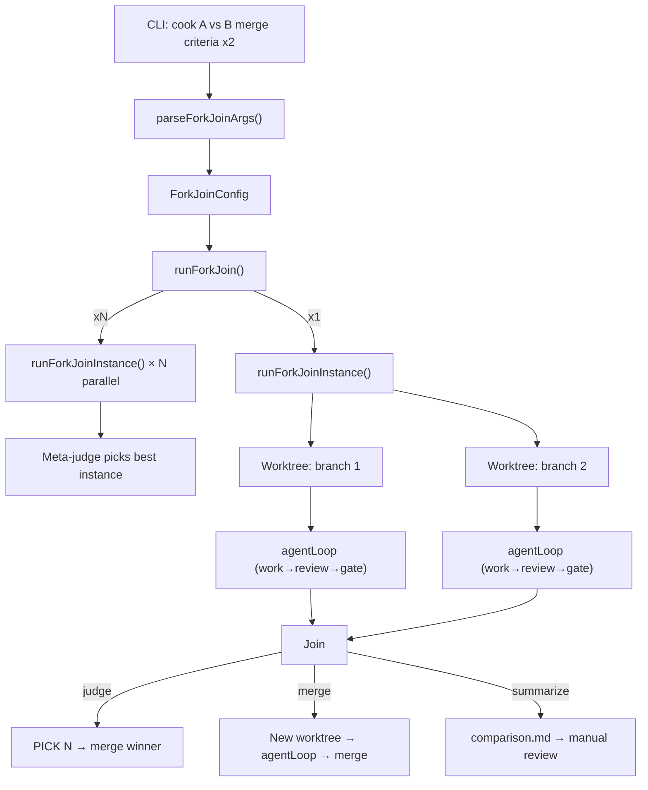

# Fork-join: parallel exploration of different approaches with automated join

Add a fork-join mode to cook that runs two or more different approaches in parallel (each in its own git worktree with a full work→review→gate loop), then combines the results via a configurable join strategy. This is a generalization of race mode — where race runs N identical loops, fork-join runs M different prompts and decides how to combine them.

## Architecture



## Decisions

1. **Separate `fork-join.ts` instead of extending `race.ts`.** Race handles N identical runs; fork-join handles M different prompts with join strategies. Keeping them separate avoids bloating race.ts and keeps concerns clean. Fork-join imports shared utilities (`createWorktree`, `removeWorktree`, `buildJudgePrompt`, `parseJudgeVerdict`, `sessionId`) from race.ts.

2. **`vs` as the fork-join trigger.** The presence of `vs` in args routes to fork-join parsing instead of single-loop or race. `x<N>` without `vs` continues to route to race mode unchanged. This preserves full backwards compatibility.

3. **`merge` as the default join strategy.** When `vs` is present with no explicit join keyword, it defaults to `merge` — synthesizing the best of both branches is the most common use case. `judge` and `summarize` are opt-in.

4. **`x<N>` means the same thing in both modes.** "Run N parallel instances of this pipeline." In race mode the pipeline is a single loop; in fork-join mode it's a fork-join instance. The meta-judge compares instance winners using the criteria string after `x<N>`, falling back to the join criteria.

5. **Fix: removed `await waitCombinedExit()` in the multi-instance path.** Ink's `waitUntilExit()` only resolves when the component calls `useApp().exit()`, not from an external `unmount()`. The combined TUI's component already calls `exit()` when all runs show done, but the meta-judge phase runs after `Promise.allSettled` completes — after the TUI naturally finishes. Awaiting the exit promise caused the meta-judge to never execute.

## Code Walkthrough

1. **`src/fork-join.ts`** (new, 813 lines) — The core implementation. Start here. `ForkJoinConfig` and `ForkJoinBranch` define the structured config. `runForkJoin()` is the entry point — it handles single-instance vs multi-instance (`x<N>`) paths. `runForkJoinInstance()` creates worktrees, runs branches in parallel, then dispatches to `judgeInstance()`, `mergeInstance()`, or `summarizeInstance()`. `handleInstanceResult()` applies the winner (git merge) and cleans up worktrees.

2. **`src/cli.ts`** — `parseForkJoinArgs()` (new function) scans positional args left-to-right, splitting on `vs`, recognizing join keywords (`judge`/`merge`/`summarize`), and extracting `x<N>` with optional meta-criteria. `hasForkJoinSyntax()` detects `vs` in args. `main()` routes to `cmdForkJoin()` when `vs` is present. Also: `StepSelection` moved to `config.ts`, `cleanupActiveForkJoins()` wired into SIGINT/SIGTERM, `fork/` added to default `.gitignore`.

3. **`src/race.ts`** — Exports made public: `sessionId`, `createWorktree`, `removeWorktree`, `buildJudgePrompt`, `parseJudgeVerdict`, `pickOne`, `RunResult`, `createRunnerPool`. `sessionId()` now appends a random suffix to avoid collisions when multiple instances create worktrees in the same second. `createWorktree()` signature generalized to accept explicit path and branch name instead of computing them internally.

4. **`src/ui/RaceApp.tsx`** — Added `title`, `runLabel`, and `runLabels` props so fork-join can customize the TUI header ("Branch" instead of "Run", instance.branch labels like "1.1", "1.2"). Fixed step label to hide after done/error.

5. **`src/config.ts`** — `StepSelection` interface moved here from `cli.ts` and `race.ts` (was duplicated) so both `fork-join.ts` and `cli.ts` can import it.

6. **`README.md`** — New "Fork-join mode" section documenting `vs` syntax, all three join strategies, per-branch prompts, and `x<N>` meta-parallelism. Fork-join examples added to intro and Options sections.

## Testing Instructions

1. **Setup:** `cd` into a git repo, run `cook init`, ensure `cook doctor` passes
2. **Basic fork-join with merge (default):**
   ```sh
   cook "Create word.txt with papaya" vs "Create word.txt with mango" merge "pick the more tropical word"
   ```
   Expect: two branches run in parallel, merge agent synthesizes, result merged to current branch
3. **Fork-join with judge:**
   ```sh
   cook "Approach A" vs "Approach B" judge "which is cleaner"
   ```
   Expect: two branches run, judge picks one, winner merged to current branch
4. **Fork-join with summarize:**
   ```sh
   cook "Approach A" vs "Approach B" summarize
   ```
   Expect: comparison doc at `.cook/fork/comparison-<session>.md`, worktrees preserved
5. **Meta-parallelism (`x2`):**
   ```sh
   cook "Approach A" vs "Approach B" judge "which is better" x2 "pick best instance"
   ```
   Expect: 4 parallel runs (2 instances × 2 branches), per-instance judges, then meta-judge picks best instance, winner merged, worktrees cleaned up
6. **Backwards compat:** verify `cook "prompt" x3` still works as race mode (no `vs` present)
