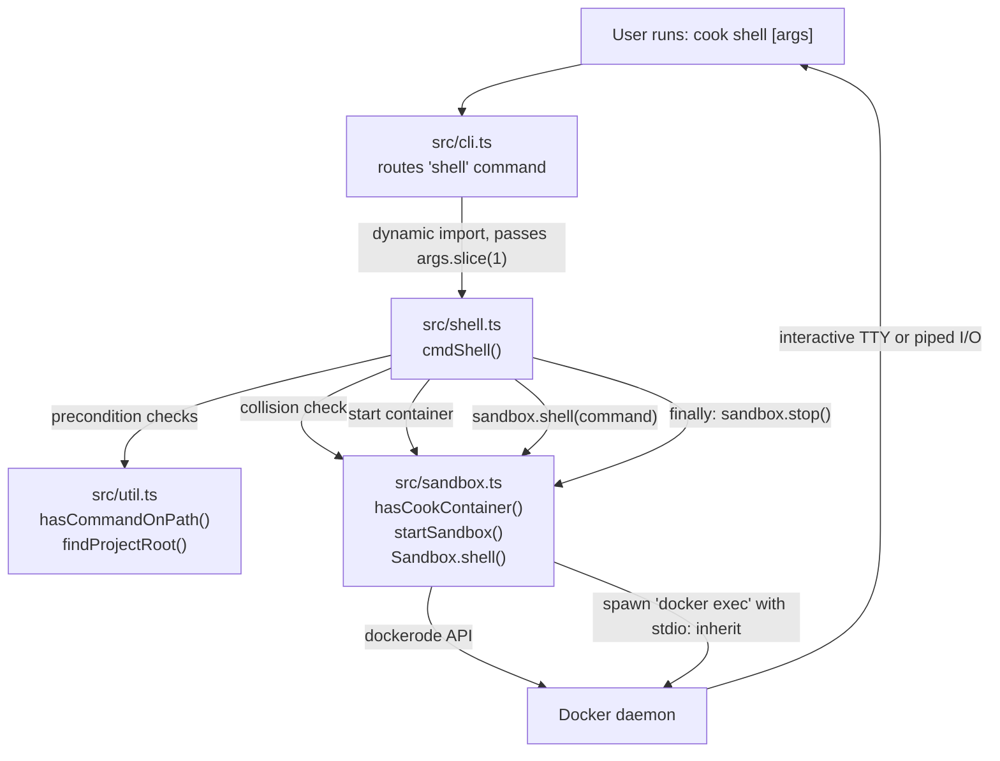

# Add `cook shell` -- interactive sandbox shell

Adds a `cook shell` subcommand that starts the project's Docker sandbox container and attaches an interactive terminal session. Cook's sandbox setup (image building, user creation, auth file copying, network restrictions, project mounting) was previously only accessible through the agent loop. This change makes the sandbox a first-class interactive tool, so users can inspect the environment, debug issues, install dependencies, or run agents manually without reconstructing the container setup by hand.

## Architecture



## Decisions

1. **Separate `src/shell.ts` module instead of inlining in `cli.ts`.** The shell command has its own flag parsing (`--unrestricted`, `--help`), precondition checks, and lifecycle management. Keeping it in its own module follows the existing pattern where `cli.ts` is a thin router and domain logic lives in dedicated modules.

2. **`Sandbox.shell()` method instead of exposing container internals.** The alternative was adding public getters for `containerId`, `userSpec`, and `containerEnv` and letting the CLI construct the `docker exec` command. That would break encapsulation and duplicate container knowledge across modules. The `shell()` method keeps all container details inside the `Sandbox` class.

3. **Async `spawn` + promise instead of `spawnSync`.** `spawnSync` would block the Node.js event loop for the entire shell session, preventing cleanup handlers and signal forwarding from working. The async approach lets the `finally` block and `process.exitCode` work correctly.

4. **Respect network restrictions by default with `--unrestricted` opt-in.** Silently overriding the project's `docker.json` security config would be surprising. Instead, the shell respects network restrictions and prints a notice so users immediately understand why network calls fail and how to fix it.

5. **Moved `hasCommandOnPath` and `findProjectRoot` to `src/util.ts`.** The plan left this as "export from cli.ts or move to shared util." Exporting from `cli.ts` was problematic because it has top-level side effects (SIGINT/SIGTERM handlers, `process.argv` parsing) that would execute on import. A dedicated utility module avoids that.

6. **Container collision check before starting.** `cmdShell` checks for a running cook container before calling `startSandbox` (which cleans up stopped containers). This prevents accidentally killing an in-progress agent loop. The check uses the same label + name-prefix matching as `cleanupStaleContainers` for consistency.

## Code Walkthrough

1. **`src/util.ts`** -- Start here. New shared utility module containing `hasCommandOnPath` (moved from `cli.ts`) and `findProjectRoot` (previously duplicated). These are pure functions with no side effects.

2. **`src/sandbox.ts`** -- Two additions to the sandbox module:
   - `hasCookContainer(docker, projectRoot)` -- queries Docker for running containers with the `cook.project` label and `/cook-` name prefix. Exported for use by shell.ts.
   - `Sandbox.shell(args)` -- spawns `docker exec` with `stdio: 'inherit'` for transparent TTY passthrough. Detects TTY to decide `-i -t` vs `-i` only. Maps signal-killed processes to `128 + signal` exit codes per Unix convention.
   - `ensureBaseImage` and `startSandbox` gain an optional `verbose` parameter (defaults to `false` for backward compat) so shell mode can show Docker build progress.

3. **`src/shell.ts`** -- The main orchestrator. `cmdShell` parses flags (`--unrestricted`, `--help`, `--` separator), runs precondition checks (docker on PATH, `.cook/config.json` exists, no running container), starts the sandbox with `verbose: true`, prints a network restriction notice if applicable, calls `sandbox.shell()`, and cleans up in a `finally` block. Uses `process.exitCode` instead of `process.exit()` to allow graceful cleanup.

4. **`src/cli.ts`** -- Minimal changes: adds `case 'shell'` with a dynamic import of `shell.ts`, adds shell lines to the usage text, and replaces the local `hasCommandOnPath`/`findProjectRoot` with imports from `util.ts`.

## Testing Instructions

1. **Interactive shell** -- In an initialized cook project (`cook init` already run), run:
   ```
   cook shell
   ```
   Expect: sandbox starts (with build progress if first run), network restriction notice printed, drops into a bash prompt inside the container. Verify the working directory matches your project root. Type `exit` to leave; container should be cleaned up.

2. **Command execution** -- Run a one-shot command:
   ```
   cook shell ls -la
   ```
   Expect: lists files in the project directory inside the sandbox, then exits. No interactive prompt.

3. **Unrestricted networking** -- Run:
   ```
   cook shell --unrestricted
   ```
   Expect: no network restriction notice. Inside the shell, `curl https://example.com` should succeed. Compare with `cook shell` (restricted) where the same curl should fail.

4. **`--` separator** -- Run:
   ```
   cook shell -- env --unrestricted
   ```
   Expect: runs `env --unrestricted` inside the container (the `--unrestricted` flag is passed to `env`, not consumed by cook). Should print environment variables; `--unrestricted` will be silently ignored by `env`.

5. **Help** -- Run:
   ```
   cook shell --help
   ```
   Expect: prints shell-specific usage text and exits immediately. No Docker work should happen.

6. **No Docker CLI** -- Temporarily rename or remove docker from PATH, then run:
   ```
   cook shell
   ```
   Expect: error message "docker CLI not found on PATH. Install Docker and try again." with exit code 1.

7. **No `.cook/` directory** -- Run `cook shell` in a directory without `cook init`:
   ```
   cook shell
   ```
   Expect: error message "Project not initialized for cook. Run 'cook init' first." with exit code 1.

8. **Container collision** -- Start an agent loop (`cook "do something"`) in one terminal, then in another terminal in the same project:
   ```
   cook shell
   ```
   Expect: error message "A cook container is already running for this project. Stop it first or use 'docker exec' directly." with exit code 1.

9. **Piped input (non-TTY)** -- Run:
   ```
   echo "ls -la" | cook shell
   ```
   Expect: runs with `-i` but not `-t` (no TTY allocation). Should execute the piped command.

10. **Exit code propagation** -- Run:
    ```
    cook shell bash -c "exit 42"
    ```
    Expect: cook exits with code 42. Verify with `echo $?`.
