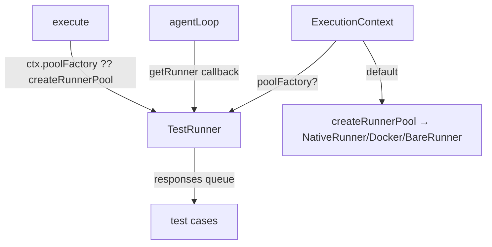

# Add test harness: Vitest + TestRunner injection

Adds a complete test suite (63 tests, 5 files) to the cook CLI. The suite covers the full SPEC.md surface — parser, agent loop, executor (work/review/ralph/repeat), composition helpers, and template rendering — with no real LLM calls and no Docker.

## Architecture

The core change is a single optional `poolFactory?` field on `ExecutionContext`. In production the field is absent and the executor falls back to `createRunnerPool` from `race.ts`. In tests, setting `poolFactory: testPoolFactory(new TestRunner(['DONE']))` injects a queue-driven mock runner across all execute paths (work, review, ralph, composition branches) without touching any production code paths.

## Decisions

1. **`poolFactory` on `ExecutionContext` over `vi.mock` or a fake CLI binary.** Module-level mocking is fragile and order-dependent. A fake binary requires filesystem coordination and env-var passing across parallel tests. The `poolFactory` field is explicit, typed, and self-documenting. One field addition, no subclass, no binary.

2. **`parseRalphVerdict` exported for direct unit testing.** The function has an asymmetric fail-safe (defaults to `DONE`, not `ITERATE`) that is important to document as a test. Testing it only via `executeRalph` behavior adds indirection. Exporting it and testing it directly is clearer.

3. **`vi.mock('ink', ...)` at the top of `executor.test.ts`.** Every executor path that bottoms out at a `work` or `review` node calls Ink's `render()`. In a non-TTY test environment this writes noise or hangs. The mock is hoisted by Vitest and stubs `render` to return no-op `unmount`/`waitUntilExit` functions.

4. **Composition integration tests deferred.** Full composition tests require a real git repo, per-worktree pools, and coordinated mock response sequences across parallel branches. The pure function tests for `buildJudgePrompt` and `parseJudgeVerdict` cover the resolver logic; full worktree integration is v1+.

## Code Walkthrough

1. `src/executor.ts` — `ExecutionContext` interface gains `poolFactory?`; 7 `createRunnerPool(...)` calls become `(ctx.poolFactory ?? createRunnerPool)(...)` (lines 105, 192, 310, 454, 714, 792, 914); `parseRalphVerdict` exported.
2. `src/testing/test-runner.ts` — `TestRunner` (queue-driven `AgentRunner`), `makeTestPool`, `testPoolFactory` helpers.
3. `vitest.config.ts` — minimal config, `environment: 'node'`, matches NodeNext module resolution.
4. `src/parser.test.ts` — 16 tests: all AST node types, flags, edge cases.
5. `src/loop.test.ts` — 17 tests: `parseGateVerdict` table tests, `agentLoop` with `TestRunner`.
6. `src/executor.test.ts` — 10 tests: `parseRalphVerdict` direct + executor integration with mocked Ink.
7. `src/race.test.ts` — 15 tests: `parseJudgeVerdict`, `buildJudgePrompt`, `sessionId`.
8. `src/template.test.ts` — 5 tests: `renderTemplate`, `loadCookMD`.

## Testing Instructions

1. `npm install` (installs Vitest)
2. `npm test` — should report `63 passed (63)` across 5 files in ~300ms
3. `npm run build` — TypeScript compilation must succeed with no errors
