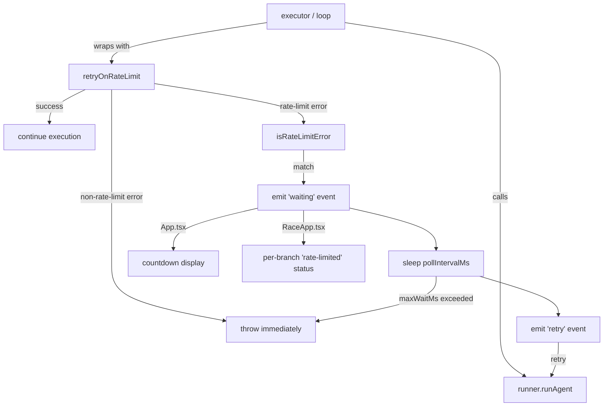

# Add automatic retry on rate-limit errors

When a subagent (Claude Code, Codex, OpenCode) hits a token quota or rate limit, cook now detects the error from stderr, displays a countdown in the TUI, and retries the failed step automatically once the quota resets — instead of bailing the entire run. This is enabled by default and can be disabled with `--no-wait` or `retry.enabled: false` in config. Closes #25.

## Architecture

## Decisions

1. **Hybrid wrapper pattern (Option C):** Rather than burying retry logic inside `AgentRunner` (no UI access) or duplicating it at every call site, we created a standalone `retryOnRateLimit` wrapper that callers invoke with their own event callbacks. This keeps retry logic centralized in one module while letting each call site emit to its own event emitter for UI feedback.

2. **String-matching detection over structured errors:** Since cook shells out to CLI tools (not APIs), rate-limit detection relies on regex patterns against stderr text (`/rate.?limit/i`, `/\b429\b/`, `/quota/i`, etc.). Non-matching errors fail immediately — no accidental retries on real errors.

3. **Step-level retry, not conversation resume:** When a rate limit is hit mid-step, the entire step is re-run from scratch on retry. Partial stdout is discarded. This is simpler and more reliable than trying to resume a subprocess conversation.

4. **Enabled by default with opt-out:** Long-running workflows are the primary use case for cook, and rate limits are expected. Defaulting to retry means the common case works without configuration. `--no-wait` provides fast-fail for CI or debugging.

## Code Walkthrough

1. **`src/retry.ts`** (new) — Core module. `isRateLimitError()` pattern-matches stderr against 8 regex patterns. `retryOnRateLimit()` wraps any async function with poll-and-retry, supporting `AbortSignal` for clean cancellation and `onWaiting`/`onRetry` callbacks for UI events.

2. **`src/config.ts`** — Adds `retry: RetryConfig` to `CookConfig`. Parses `retry.pollIntervalMinutes` and `retry.maxWaitMinutes` from `.cook/config.json`. Defaults: 5 min poll, 6 hour max wait.

3. **`src/parser.ts`** — Adds `noWait` boolean to `ParsedFlags`, `--no-wait` to `BOOLEAN_FLAGS`.

4. **`src/cli.ts`** — `--no-wait` in help text. When set, overrides `config.retry.enabled = false`.

5. **`src/loop.ts`** — The `agentLoop` `runAgent` call is wrapped with `retryOnRateLimit`, emitting `waiting`/`retry` events on the loop's event emitter. `LoopConfig` gains a `retry: RetryConfig` field.

6. **`src/executor.ts`** — All 6 `runAgent` call sites wrapped: `executeWork`, `executeRalph` gate (2 sites), `executeBranchForComposition` work, `resolvePick` judge, `resolveCompare` agent. Each passes its own emitter for UI events.

7. **`src/ui/App.tsx`** — Handles `waiting`/`retry` events. Shows a yellow "Rate limited — retrying in M:SS" countdown bar with a 1-second tick interval. Clears on retry.

8. **`src/ui/RaceApp.tsx`** — Adds `rate-limited` status (orange) with per-branch countdown. Clears to `running` on retry.

## Testing Instructions

1. Build: `npm run build`
2. Type-check: `npx tsc --noEmit` (clean)
3. Full integration test suite: 20/20 pass (see `tests/runs/20260319-111428/RESULTS.md`)
4. Verify `--no-wait` appears in `cook --help`
5. Verify `cook doctor` still works
6. To test actual retry behavior: run a long workflow until rate-limited — cook should display a countdown and resume automatically after the quota resets
