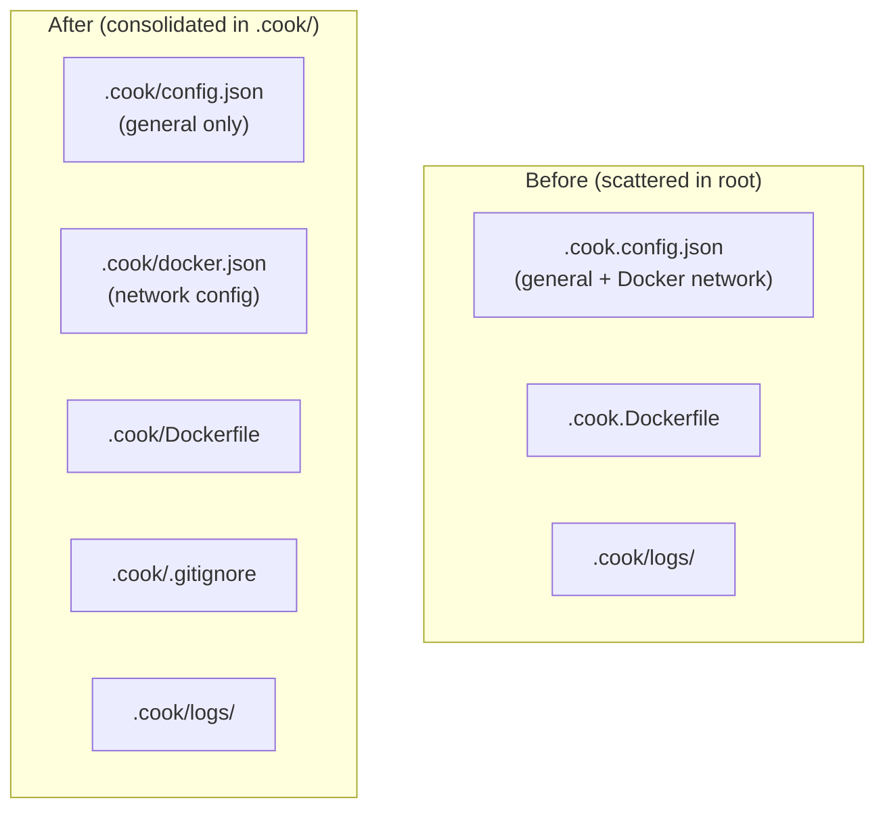

# Config Restructure: Move files into .cook/, split Docker config

Consolidates config files into the `.cook/` directory and extracts Docker-specific settings into a separate `.cook/docker.json` file. After the 2.0 native-first release, most users never touch Docker config — this keeps the default config minimal and the project root clean.

## Architecture

## Decisions

1. **No `DEFAULT_DOCKER_CONFIG_JSON` scaffolding.** The plan suggested generating a Docker config template, but since most users are on native mode post-2.0, `cook init` doesn't generate `.cook/docker.json`. The internal default constant exists for fallback. Users who need Docker can create the file manually following README examples.

2. **`startSandbox()` takes `env` and `DockerConfig` separately instead of full `CookConfig`.** The plan specified accepting `DockerConfig` instead of `CookConfig`, but the implementation went further — it also separated the `env` array as its own parameter. This gives `startSandbox()` a narrower interface: it only receives what it actually needs (env passthrough list + Docker network settings), with no dependency on the general config type.

3. **`cmdDoctor` needed no structural changes.** The plan anticipated possible changes to `cmdDoctor`'s config path handling, but since it already goes through `loadConfig()` (which now handles resolution internally), only the auth-check error message strings needed updating.

## Code Walkthrough

1. **`src/config.ts`** — Start here. `CookConfig` loses its `network` field; new `DockerConfig` interface added. `loadDockerConfig()` reads `.cook/docker.json`.

2. **`src/sandbox.ts`** — `resolveDockerfilePath()` looks up `.cook/Dockerfile`. `startSandbox()` signature changes from `(docker, projectRoot, config, agents)` to `(docker, projectRoot, env, dockerConfig, agents)`, and internal `env` variable renamed to `containerEnv` for clarity.

3. **`src/cli.ts`** — `cook init` now generates files inside `.cook/` (config.json, Dockerfile, .gitignore). `DEFAULT_COOK_CONFIG_JSON` drops the `network` field. `FALLBACK_CONFIG` updated to match. Docker sandbox factory calls `loadDockerConfig()` and passes it to `startSandbox()`. Auth-check error messages reference `.cook/config.json`.

4. **`README.md`** — Configuration section rewritten for new file layout. Docker network example references `.cook/docker.json`. Added documentation for the `env` config field explaining how it forwards host environment variables to agents.

## Testing Instructions

1. **Fresh init:** Run `cook init` in a new directory. Verify `.cook/config.json`, `.cook/Dockerfile`, `.cook/.gitignore`, and `.cook/logs/` are created. Verify no `.cook.config.json` or `.cook.Dockerfile` in root.
2. **Docker config:** Create `.cook/docker.json` with `{"network": {"mode": "restricted", "allowedHosts": ["registry.npmjs.org"]}}`. Run with `--sandbox docker`. Verify the allowed host is applied.
3. **No config:** Run `cook doctor` in a project with no `.cook/config.json`. Verify defaults are used without errors.
