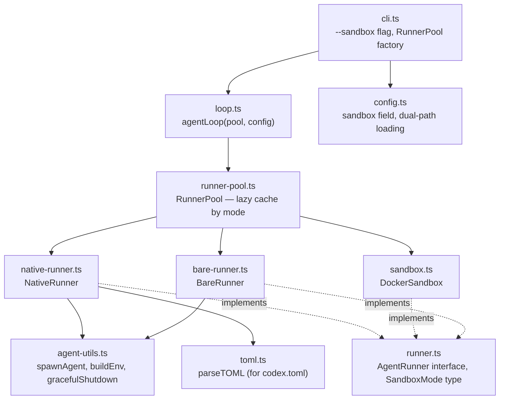

# Native Agent Sandbox as Default

Replace Docker as the default sandbox with each agent's own native OS-level sandbox (Seatbelt, Landlock, permission rules). Docker becomes a secondary mode (`sandbox: "docker"`), and a new `sandbox: "none"` mode exists for pre-isolated VMs. This eliminates Docker as a hard dependency, stops bypassing agent-level safety mechanisms with `--dangerously-skip-permissions`, and provides purpose-built autonomous configs that are safe by default — even with zero configuration.

## Architecture



## Decisions

1. **Agent-native sandbox as default (`sandbox: "agent"`).** Claude Code's Seatbelt/Landlock + permission rules and Codex's OS-level sandbox + approval policies provide fine-grained control that a Docker container with `--dangerously-skip-permissions` doesn't. No Docker required for the happy path.

2. **Config isolation via `CLAUDE_CONFIG_DIR`.** Claude Code's permission arrays concatenate across config scopes — a user's `~/.claude/settings.json` allowlist entries would expand cook's intended permissions. Cook creates a temp directory per run containing only `.credentials.json` (for auth) and `settings.json` (cook's permissions), then sets `CLAUDE_CONFIG_DIR` to isolate from user config entirely.

3. **Codex uses CLI flags, no config isolation needed.** Codex's security-critical settings (`--sandbox`, `--ask-for-approval`) are scalar values where CLI flags win outright. User's `~/.codex/config.toml` cannot weaken cook's sandbox or approval settings.

4. **OpenCode blocked from `sandbox: "agent"`.** OpenCode has no OS-level sandbox — its permissions are advisory, not enforced. Using it with `sandbox: "agent"` would create a false sense of security. OpenCode works with `sandbox: "docker"` or `sandbox: "none"`.

5. **Single set of default permissions.** Zero-config runs and `cook init` generated configs use the same permission set. The agent's OS sandbox restricts filesystem access to the project directory, so broad patterns like `Bash(mkdir *)` are safe. No need for a separate locked-down tier.

6. **Config files move to `.cook/` directory.** `.cook.config.json` → `.cook/config.json`, `.cook.Dockerfile` → `.cook/Dockerfile`. Docker-specific settings extracted to `.cook/docker.json`. Agent configs in `.cook/agents/`. Legacy paths still supported for backward compat.

7. **Per-step sandbox overrides.** Each step can specify `sandbox: "agent"|"docker"|"none"` independently, enabling patterns like "work in a sandbox, review without one."

## Code Walkthrough

1. **`src/runner.ts`** (13 lines) — Start here. `AgentRunner` interface and `SandboxMode` type define the contract.

2. **`src/runner-pool.ts`** (28 lines) — `RunnerPool` with lazy async factory. Creates runners on demand, caches by mode, single `cleanupAll()` at end.

3. **`src/native-runner.ts`** (166 lines) — The new default. `NativeRunner` spawns Claude with `CLAUDE_CONFIG_DIR` temp dir isolation, Codex with CLI flags parsed from `.cook/agents/codex.toml`, rejects OpenCode. Config resolution: `.cook/agents/<agent>.<ext>` → hardcoded defaults.

4. **`src/bare-runner.ts`** (68 lines) — `BareRunner` for `sandbox: "none"`. All agents run with full-bypass flags. No config isolation — uses user's native agent config.

5. **`src/agent-utils.ts`** (121 lines) — Shared utilities extracted during review: `spawnAgent()` (stdio piping, 1MB stderr cap, line buffering), `gracefulShutdown()` (SIGTERM → 5s → SIGKILL), `buildEnv()`, `gitConfig()`, `whichSync()`.

6. **`src/toml.ts`** (94 lines) — Minimal TOML parser for `codex.toml`. Handles tables, strings, booleans, numbers. Replaces `smol-toml` dependency.

7. **`src/config.ts`** (99 lines) — `sandbox` field added to `CookConfig`, `StepAgentConfig` gets optional `sandbox` override. Dual-path loading: `.cook/config.json` → `.cook.config.json` fallback. Env passthrough uses replacement semantics (user list replaces defaults entirely).

8. **`src/sandbox.ts`** (429 lines) — `Sandbox` → `DockerSandbox`, implements `AgentRunner`. `stop()` → `cleanup()`. Docker-specific `DockerConfig` type. Hostname validation for iptables. 1MB stderr cap. Windows guard for `process.getuid`.

9. **`src/loop.ts`** (109 lines) — `agentLoop()` now accepts `RunnerPool` instead of `Sandbox`. Per-step sandbox resolution via `pool.get(mode)`. CRLF-safe gate verdict parsing.

10. **`src/cli.ts`** (768 lines) — `--sandbox` CLI flag. `RunnerPool` factory (NativeRunner/DockerSandbox/BareRunner). `cook init` generates 8 files including `.cook/agents/`. Mode-aware `cook doctor`. `cook rebuild` guard (docker-only). Cleanup promise pattern for double Ctrl+C safety. SIGINT→130, SIGTERM→143.

## Testing Instructions

1. **Zero-config native mode (Claude):**
   ```bash
   cook "create a hello world script"
   ```
   Should run without Docker, using Claude's native sandbox with cook's locked-down permissions.

2. **Explicit Docker mode:**
   ```bash
   cook --sandbox docker "create a hello world script"
   ```
   Should behave exactly like pre-change cook (Docker container, `--dangerously-skip-permissions`).

3. **No sandbox mode:**
   ```bash
   cook --sandbox none "create a hello world script"
   ```
   Should run agent directly with full-bypass flags, no isolation.

4. **cook init:**
   ```bash
   cook init
   ```
   Should generate `.cook/config.json`, `.cook/docker.json`, `.cook/Dockerfile`, `.cook/.gitignore`, `.cook/agents/claude.json`, `.cook/agents/codex.toml`, `.cook/agents/opencode.json`, `COOK.md`.

5. **cook doctor:**
   ```bash
   cook doctor
   ```
   Should show mode-aware checks (agent CLI presence for agent/none mode, Docker for docker mode).

6. **OpenCode + agent mode rejection:**
   ```bash
   cook --agent opencode "hello"
   ```
   Should fail with clear error about OpenCode lacking a native OS sandbox.

7. **Per-step sandbox override:** Add `"sandbox": "none"` to a step in `.cook/config.json` and verify it uses BareRunner for that step.
