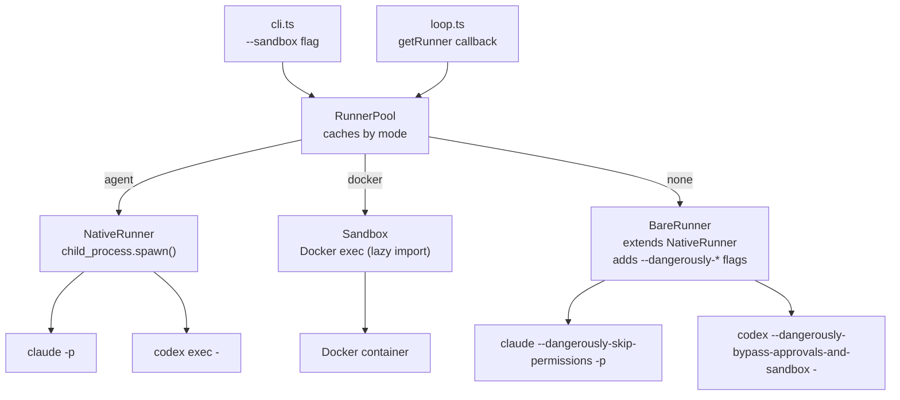

# Simplify native runner, drop Docker requirement

Cook now runs agents natively by default, spawning them directly on the host and trusting their OS-level sandboxes (Claude's Seatbelt/Landlock, Codex's workspace sandbox). Docker becomes optional — only loaded when `--sandbox docker` is used. A new `--sandbox` flag lets users choose between `agent` (native, default), `docker` (container isolation), and `none` (bare, all safety bypassed). Per-step sandbox overrides allow mixing modes in a single run.

## Architecture

## Decisions

1. **Native as default, not opt-in.** The whole point is reducing friction for new users. Docker should be the opt-in for users who want extra container isolation, not the barrier to entry.

2. **No agent config management.** The prior plan (n5x) added ~200 lines of complexity to manage agent configs (TOML parser, temp config dirs, permission constants). This plan trusts users to configure their own agents. Cook orchestrates the loop; agents sandbox themselves.

3. **Callback pattern for loop.ts.** The loop receives a `getRunner(mode)` callback rather than a `RunnerPool` directly. This keeps the loop's dependency surface minimal — it doesn't need to know about pool semantics or sandbox mode resolution.

4. **BareRunner via inheritance.** `BareRunner extends NativeRunner` and overrides a single `getBypassFlags()` method. This avoids duplicating spawn logic — the only difference between native and bare mode is the presence of `--dangerously-*` flags.

5. **OpenCode blocked in native/bare modes.** OpenCode has no OS-level sandbox — its permissions are advisory. Running it without Docker gives a false sense of security, so we throw rather than silently allowing it.

6. **`optionalDependencies` for Docker packages.** `dockerode` and `tar-stream` moved from `dependencies` to `optionalDependencies`, and marked `external` in tsup config. Users who only use native mode never need Docker installed.

7. **Auth messages updated for native-awareness.** Host login is now sufficient for Claude in native mode. Error messages no longer reference "container-usable credentials" since that's Docker-specific language.

## Code Walkthrough

1. **`src/runner.ts`** — Start here. Defines the `AgentRunner` interface, `SandboxMode` type, and `RunnerPool` class. Small file, establishes the abstraction.
2. **`src/native-runner.ts`** — Core new code. `NativeRunner` spawns agents via `child_process.spawn()`, pipes prompt via stdin, streams stdout through `LineBuffer`. Has `getBypassFlags()` hook returning `[]`.
3. **`src/bare-runner.ts`** — Tiny. Extends `NativeRunner`, overrides `getBypassFlags()` to return `--dangerously-*` flags per agent.
4. **`src/sandbox.ts`** — Minimal change: adds `implements AgentRunner` to `Sandbox` class.
5. **`src/config.ts`** — Adds `sandbox: SandboxMode` to `CookConfig` and `StepAgentConfig`, with parsing and validation.
6. **`src/loop.ts`** — Swaps `sandbox: Sandbox` parameter for `getRunner: (mode: SandboxMode) => Promise<AgentRunner>` callback. Each step resolves its runner via the callback.
7. **`src/cli.ts`** — Largest change. Adds `--sandbox` flag parsing, `RunnerPool` factory with lazy Docker imports, updated `cook doctor` with mode-aware checks, updated `cook init` default config, native-aware auth checks, sandbox mode in banner output.
8. **`package.json`** — `dockerode` and `tar-stream` moved to `optionalDependencies`.
9. **`tsup.config.ts`** — Adds `external: ['dockerode', 'tar-stream']` so dynamic imports work at runtime.

## Testing Instructions

1. **Native mode (default):** Run `cook` in a project with Claude installed. Verify it spawns `claude` directly without Docker.
2. **Docker mode:** Run `cook --sandbox docker`. Verify it starts a Docker container as before.
3. **Bare mode:** Run `cook --sandbox none`. Verify it spawns with `--dangerously-skip-permissions` and prints the warning.
4. **Per-step override:** Set `"sandbox": "docker"` on a single step in `.cook.config.json`, leave global as `"agent"`. Verify the step uses Docker while others use native.
5. **No Docker installed:** Uninstall/stop Docker, run `cook` (native mode). Verify it works without Docker errors.
6. **`cook doctor`:** Run in each mode and verify it checks the right things (agent CLI on PATH for native, Docker daemon for docker).
7. **OpenCode guard:** Set agent to `opencode` with `--sandbox agent`. Verify it throws with a clear error message.
