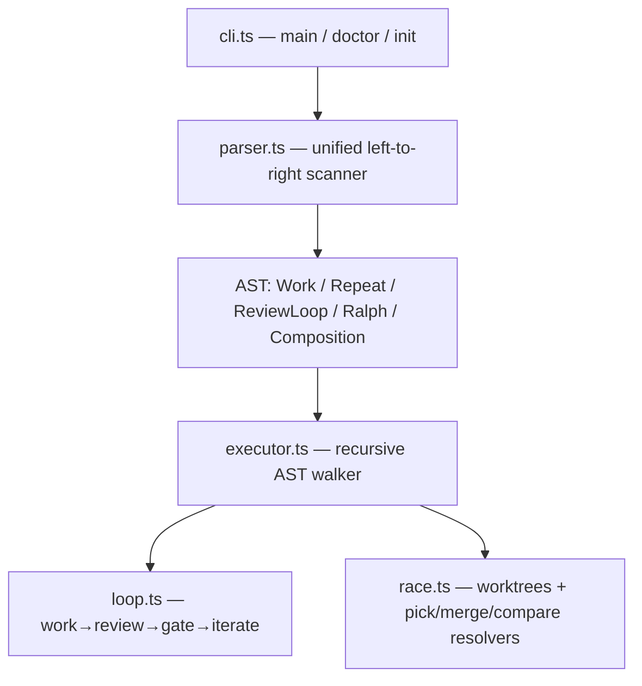

# r7w: Align implementation to SPEC.md (parser, executor, review loop, ralph)

Rewrites cook's parser and execution engine to match SPEC.md exactly. `xN` becomes sequential repeat (not parallel race), `vN`/`race N` takes over as the parallel versions operator, resolver keywords rename (`judge`→`pick`, `summarize`→`compare`), and `review` becomes an explicit opt-in keyword. A new unified parser produces a recursive AST, a new recursive executor walks it, and ralph (outer task loop) and the iterate step (4th prompt) are added.

## Architecture



## Decisions

1. **Single-pass recursive AST parser** over incremental migration — three ad-hoc parsers with duplicated flag logic were the root cause of every composition gap. Ralph, iterate, and proper xN semantics all fall out naturally from the AST representation.
2. **`parseRalphVerdict` defaults to DONE** (fail-safe) — if the ralph gate produces no parseable verdict, stopping is safer than blindly advancing to the next task.
3. **`skipFirstWork` in agentLoop** — when `review` wraps a compound inner node (e.g. `cook "work" x3 review`), the inner node already ran work; the loop starts at review on iteration 1 rather than running a spurious extra work step first.
4. **`fork-join.ts` deleted** — resolver logic moved into executor.ts rather than extracted to a separate `resolvers.ts`; the executor is not excessively long and the coupling is tight.

## Code Walkthrough

1. `src/parser.ts` — start here. `parse()` → `separateFlags` + `parsePipeline` (single pipeline) or the `vs` branch splitter. Each operator wraps `current` leftward, producing the AST bottom-up.
2. `src/executor.ts` — `execute()` dispatches on `node.type`. Work, repeat, review, ralph, and composition handlers. `executeBranchForComposition` mirrors the top-level handlers but routes TUI events to per-branch emitters. Resolvers (`resolvePick`, `resolveMerge`, `resolveCompare`) at the bottom.
3. `src/loop.ts` — `agentLoop` with the iterate step and `skipFirstWork` option. `LoopResult` return type used by ralph to detect non-convergence.
4. `src/config.ts` — `StepName` now includes `iterate` and `ralph`. `resolveStepSelection` fallbacks: iterate→work, ralph→gate.
5. `src/template.ts` — cache keyed on both template source and `paramKey` (ordered context keys) to prevent stale function reuse across different execution contexts.
6. `src/race.ts` — trimmed to worktree management, runner factory, and pick utilities. `runRace` removed.
7. `src/cli.ts` — `main()` now just parses and executes. Doctor fixed to call `separateFlags`/`buildParsedFlags` directly rather than routing through `parse()`.

## Testing Instructions

```sh
# Single call — no review loop
cook "Write a haiku"

# Explicit review loop (default prompts)
cook "Implement dark mode" review

# Positional shorthand
cook "Implement dark mode" "Review for accessibility" "DONE if no High issues, else ITERATE"

# Repeat then review (x3 work passes, then review loop)
cook "Implement dark mode" x3 review

# Review loop repeated 3 times
cook "Implement dark mode" review x3

# Ralph outer loop
cook "Read plan.md, do the next task" review "Code review" "DONE if no High issues, else ITERATE" ralph 5 "DONE if all tasks complete, else NEXT"

# Parallel versions with pick
cook "Implement dark mode" v3 pick "least lines changed"

# Fork-join
cook "Auth with JWT" vs "Auth with sessions" pick "best security and simplicity"
cook "Auth with JWT" vs "Auth with sessions" merge "cleanest implementation"
cook "Auth with JWT" vs "Auth with sessions" compare

# Second-level composition
cook "Approach A" vs "Approach B" pick "cleanest" v3 pick "most thorough"

# Doctor with agent/model flags
cook doctor --agent codex
cook doctor --work-agent claude --gate-agent codex
```
